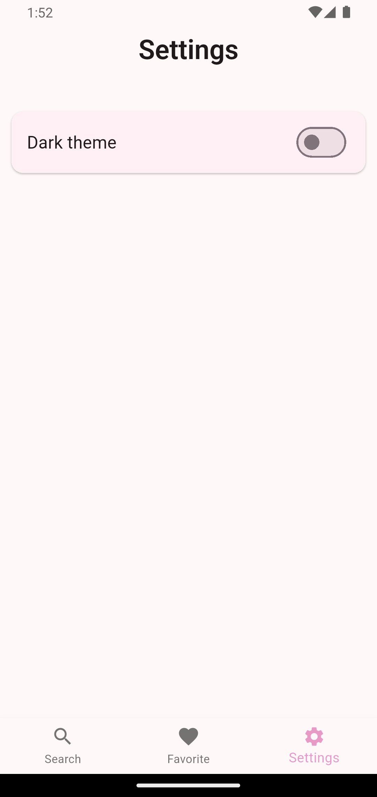

# rick_and_morty_characters

Мобильное приложение на Flutter, которое загружает список персонажей "Рик и Морти" с публичного API.

Круто, что вы выбрали Рика и Морти.

## Функциональные требования
### 1. Главный экран (Список персонажей)

- [x] Отображает список персонажей в виде карточек.
- [x] Карточка персонажа содержит:
- [x] Изображение персонажа.
- [x] Имя персонажа.
- [x] Дополнительные характеристики (на выбор разработчика, например, статус, вид,
локация и т. д.).
- [x] Кнопка "звездочка" (IconButton) для добавления в избранное (заполненная — в
избранном, пустая — не в избранном
).
### 2. Экран "Избранное"

- [x] Отображает список избранных персонажей.
- [x] Такие же карточки, как на главном экране.
- [x] Сортировка (по имени, по статусу или по другому параметру – на выбор
разработчика).
> Сортирока присутствует по 
    `Id`,
    `Name`,
    `Status`,
    `Species`,
    `Type`,
    `Gender`,
    `Origin`,
>> А также можно сортировать по возрастанию и убыванию.
- [x] Возможность удаления персонажа из избранного.

### 3. Навигация

- [x] Навбар (BottomNavigationBar) для переключения между экранами.

### 4. Дополнительно

- [x] Пагинация: подгрузка новых персонажей на главном экране при скролле.
- [x] Кеширование: загруженные данные должны сохраняться локально, чтобы
приложение работало без интернета. 
- [x] Фавориты должны сохраняться в базе данных (например, SQLite, Drift, Hive,
Isar, SharedPreferences).
> Все персонажи сохраняются в Hive вне зависимости от того избранные они или нет. 

## Нефункциональные требования

- [x] Использовать любой state management
(ChangeNotifier/bloc/StateNotifier/MobX/Redux/StateNotifier/GetX)
> Использовал bloc
- [x] Минимальный набор зависимостей (бд и работа с сетью)

- [x] API-запросы можно делать через REST или GraphQL (на выбор).
> Использовал REST
- [x] Код должен быть чистым, читаемым и структурированным.
> Попытался писать чисто, но не мне судить

### Будет плюсом:

- [x] Поддержка темной темы с возможностью переключить
> На экране настроек есть переключатель, который меняет тему. Также состояние темы сохраняется в Hive.
- [x] Кастомные анимации при добавлении/удалении избранных 
> Если кастомной анимацией можно считать пульсацию звездочки

### Дополнительно от себя

Я реализовал поиск по имени как на главном экране, так и на экране избранного.

## Скриншоты

    
    
    

    
    
    

